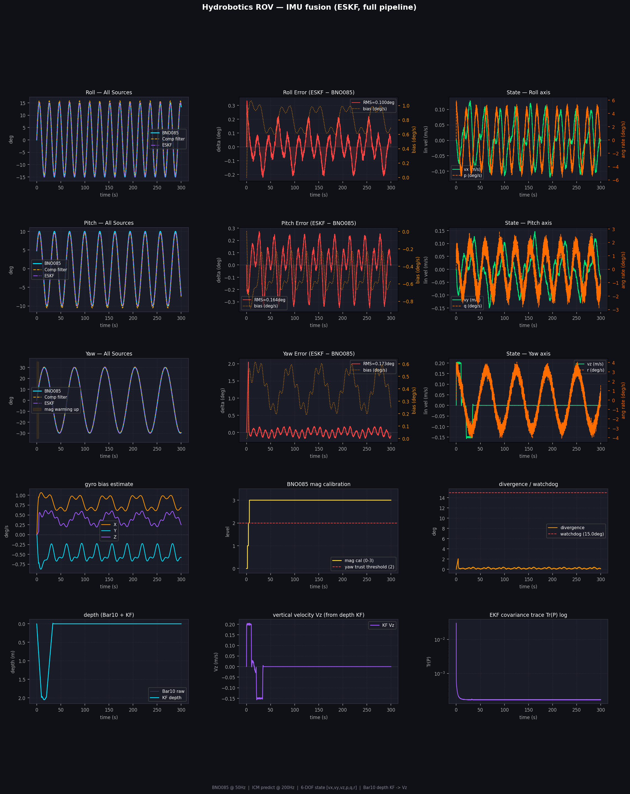

# Hydrobotics ROV: sensor fusion and control

Orientation estimation and pilot control software for a 6-DOF underwater ROV, written for Team Bath Hydrobotics.

The core of the repo is an Error-State Kalman Filter that fuses two IMUs with different characteristics: a BNO085 providing an absolute fused quaternion at 50 Hz, and an ICM-20948 providing raw gyro at 200 Hz. The filter estimates ICM gyro bias online rather than assuming it constant, so the high-rate output stays locked to the absolute reference instead of drifting between updates.



## Why this architecture

The BNO085 alone caps the update rate at 50 Hz and gives no visibility into estimate confidence. Running from raw sensors alone means rebuilding magnetometer handling that the BNO085 already does well. Cascading the two gets high-rate output while keeping an absolute reference, and makes gyro bias observable.

Sensor selection followed the same logic. A second BNO-family device would share magnetic interference and drift characteristics with the BNO085: both headings wrong by a similar amount at the same time is not redundancy. A BMI088 offers good low-drift raw output but carries no magnetometer, which would cost absolute yaw reference. The ICM-20948 gives raw 9-axis output, complementing the BNO085 rather than duplicating it. The filter currently uses its gyro and accelerometer; its magnetometer is available for an independent yaw measurement but is not yet used.

```
ICM-20948 gyro  ──200 Hz──▶  PREDICT  ─┐
                                        ├──▶  state: quaternion + gyro bias  ──▶  6-DOF state vector
BNO085 quaternion ──50 Hz──▶  CORRECT  ─┘
                                             bias fed back into predict
```

The accelerometer bypasses the filter entirely, since the BNO085 already fuses it for levelling. It is gravity-compensated, rotated to world frame using the fused attitude, and integrated separately for linear velocity, with a leak term and deadband to bound drift. Horizontal velocity still drifts without an external reference such as a DVL.

A Bar10 pressure sensor feeds a small 1-D Kalman filter for depth and vertical velocity, which is blended into the state vector when readings are fresh.

## Running it

No hardware required: mock sensor models with a known injected gyro bias let the full pipeline run anywhere.

```bash
pip install -r requirements.txt

# simulated sensors, 60 seconds, generates a plot
python3 imu_fusion.py --mock --duration 60 --plot

# real sensors over I2C
python3 imu_fusion.py --rate 50 --icm-rate 200 --plot

# sensors bridged through an STM32 over UART
python3 imu_fusion.py --stm32 /dev/ttyUSB0 --plot
```

Every run writes a CSV log and can render a diagnostic plot covering orientation, per-axis error, bias estimates, magnetometer calibration state, covariance trace and the divergence watchdog.

## Validation

Against a simulated IMU with an injected gyro bias of `[0.8, -0.5, 0.4]` deg/s unknown to the filter, the estimate converges to within 0.08 deg/s on all three axes in about 9 seconds from a cold start, and stays within that band for the rest of the run.

The mock gyro outputs body rates derived from the same attitude trajectory as the mock BNO085, so the two simulated sensors describe the same motion.

Run it yourself:

```bash
python3 imu_fusion.py --mock --duration 300 --plot --no-bias-load --no-bias-save
```

The `--no-bias-load` flag matters: without it the filter starts from a previously saved estimate rather than from zero.

### Correction (September 2026)

Earlier versions of this README reported the bias estimate oscillating by roughly ±0.2 deg/s at the motion frequency, with convergence to 0.08 deg/s taking about 25 seconds, and attributed the oscillation to the first-order quaternion integration in the prediction step. That diagnosis was wrong. At 200 Hz and these angular rates, the first-order truncation error is on the order of $10^{-7}$ deg/s, far too small to matter.

The actual cause was the mock gyro, which output the time derivatives of the Euler angles instead of body rates. The two differ whenever the vehicle is rolled or pitched, by up to about 0.7 deg/s in this simulation, so the simulated gyro and simulated BNO085 disagreed periodically and the bias state absorbed the difference. With roll and pitch set to zero the oscillation disappears; with the mock fixed to output body rates, it is gone under full motion too.

The early covariance collapse reported alongside it was a symptom of the same problem, not a separate one. The covariance in this filter barely depends on the measurements, so a shrinking trace while the bias kept moving was the filter tracking an inconsistency in the test data.

## Known limitations

**Validation is against simulated sensors.** The hardware arrived late in the project, after the filter was written, so bench testing against the real ICM and BNO is the natural next step.

**Noise parameters are set for simulation.** `Q` and `R` have not been tuned against real sensors, and the mock BNO085 is noiseless. They should be set from datasheet noise densities or an Allan variance run, then checked for consistency using the normalised innovation.

**The magnetometer trust timeout is not exercised in simulation.** The mock's calibration level reaches the threshold after 4 seconds, so the 30-second timeout path has not been tested.

**Excluding yaw still shrinks yaw uncertainty.** While yaw is excluded, the BNO085's yaw is replaced with the filter's own, which the update still treats as a measurement. Dropping the yaw row from `H` during that period would be cleaner.

## Design notes

**Magnetometer trust timeout.** Yaw is normally excluded from the correction until the BNO085 reports adequate magnetometer calibration. But an ROV sitting near thrusters and a steel frame can stay uncalibrated indefinitely, and yaw gyro bias is only observable through that correction. Past a timeout the filter trusts yaw anyway with inflated measurement noise, rather than leaving yaw unobserved forever.

**Complementary filter baseline.** A simple complementary filter runs alongside the ESKF and is logged for comparison. It exists to check the added complexity is justified rather than assumed. After the first 20 seconds, the ESKF's RMS attitude error against the simulated truth is 0.011° on each axis, against 0.84° (roll), 0.62° (pitch) and 0.46° (yaw) for the complementary filter. Most of that gap is bias: the complementary filter cannot estimate it, so it carries a steady offset of roughly bias times its time constant. Note its `ALPHA` is applied per update and is not timestep-aware, so it is only meaningful at a fixed rate.

**Joseph-form covariance update** for numerical stability, and a watchdog that flags sustained divergence between the fused estimate and the BNO085 reference.

## Repository layout

```
imu_fusion.py                ESKF, depth filter, state vector, logging and plotting
controller_server_updated.py Pilot input → 6-DOF velocity vector → TCP server
example_client.py            Minimal client for testing the control link
requirements.txt
docs/                        Diagnostic plots and diagrams
```

## Pilot control

Controller axes map to a 6-DOF body-frame velocity vector `[X, Y, Z, RX, RY, RZ]`, with deadzone filtering and per-axis inversion, packed as length-prefixed float32 and streamed over TCP at 50 Hz. Axis indices vary by controller and operating system, so the mapping constants at the top of the file may need adjusting; the startup printout lists available axes and buttons.

## Hardware

| Component | Role |
|---|---|
| BNO085 | Absolute orientation, internally fused, 50 Hz |
| ICM-20948 | Raw gyro and accelerometer, 200 Hz |
| Bar10 (MS5837) | Pressure and depth, 20 Hz |
| Jetson Orin Nano | Onboard compute |
| STM32 | Optional sensor bridge over UART |

## Licence

MIT.
