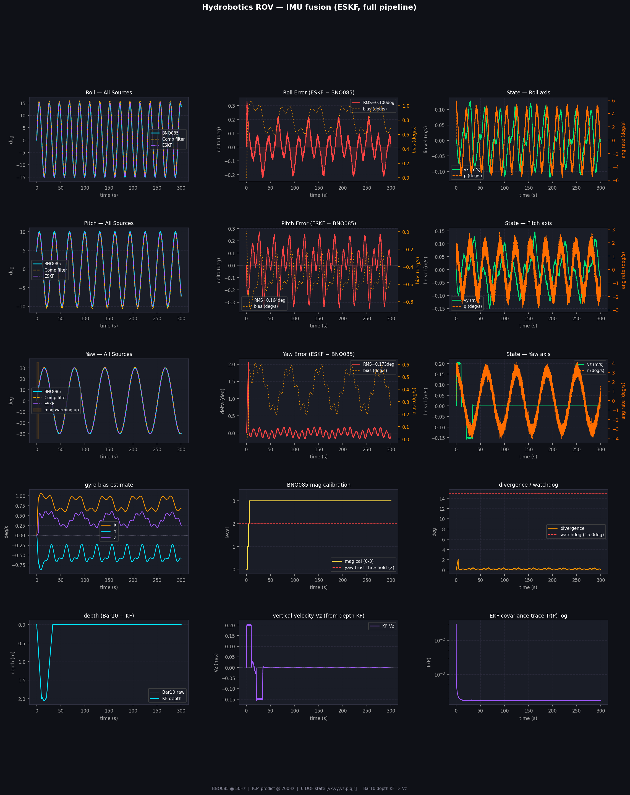

# Hydrobotics ROV: sensor fusion and control

Orientation estimation and pilot control software for a 6-DOF underwater ROV, written for Team Bath Hydrobotics.

The core of the repo is an Error-State Kalman Filter that fuses two IMUs with different characteristics: a BNO085 providing an absolute fused quaternion at 50 Hz, and an ICM-20948 providing raw gyro at 200 Hz. The filter estimates ICM gyro bias online rather than assuming it constant, so the high-rate output stays locked to the absolute reference instead of drifting between updates.



## Why this architecture

The BNO085 alone caps the update rate at 50 Hz and gives no visibility into estimate confidence. Running from raw sensors alone means rebuilding magnetometer handling that the BNO085 already does well. Cascading the two gets high-rate output while keeping an absolute reference, and makes gyro bias observable.

Sensor selection followed the same logic. A second BNO-family device would share magnetic interference and drift characteristics with the BNO085: both headings wrong by a similar amount at the same time is not redundancy. A BMI088 offers good low-drift raw output but carries no magnetometer, which would cost absolute yaw reference. The ICM-20948 gives raw 9-axis output, complementing the BNO085 rather than duplicating it. The filter currently uses its gyro and accelerometer; its magnetometer is available for an independent yaw measurement but is not yet used.

```
ICM-20948 gyro  ──200 Hz──▶  PREDICT  ─┐
                                        ├──▶  state: quaternion + gyro bias  ──▶  6-DOF state vector
BNO085 quaternion ──50 Hz──▶  CORRECT  ─┘
                                             bias fed back into predict
```

The accelerometer bypasses the filter entirely, since the BNO085 already fuses it for levelling. It is converted to m/s², gravity-compensated, rotated to world frame using the fused attitude, and integrated separately for linear velocity, with a leak term and deadband to bound drift. Horizontal velocity still drifts without an external reference such as a DVL.

A Bar10 pressure sensor feeds a small 1-D Kalman filter for depth and vertical velocity, which is blended into the state vector when readings are fresh. Depth is positive downwards and the state vector uses world z up, so the depth rate is sign-flipped before blending.

## Running it

No hardware required: mock sensor models with a known injected gyro bias let the full pipeline run anywhere.

```bash
pip install -r requirements.txt

# simulated sensors, 60 seconds, generates a plot
python3 imu_fusion.py --mock --duration 60 --plot

# real sensors over I2C
python3 imu_fusion.py --rate 50 --icm-rate 200 --plot

# sensors bridged through an STM32 over UART
python3 imu_fusion.py --stm32 /dev/ttyUSB0 --plot
```

Without `--mock`, a missing sensor library stops the program with an error rather than quietly switching to simulated data. Mock runs save their bias estimate to `imu_bias_mock.json`, so they can never overwrite the estimate used on hardware.

Extra options for testing in simulation:

```bash
# same filter with bias estimation switched off, for comparison
python3 imu_fusion.py --mock --duration 300 --freeze-bias --no-bias-load

# keep the magnetometer uncalibrated for 45 s to exercise the timeout path
python3 imu_fusion.py --mock --duration 70 --mock-mag-delay 45 --plot

# add 0.5 deg of noise to each simulated BNO085 angle
python3 imu_fusion.py --mock --duration 300 --mock-bno-noise 0.5 --plot
```

Every run writes a CSV log and can render a diagnostic plot covering orientation, per-axis error, bias estimates, magnetometer calibration state, covariance trace and the divergence watchdog.

## Validation

All results below are from simulation. The mock ICM-20948 has a gyro bias of `[0.8, -0.5, 0.4]` deg/s that the filter doesn't know about, plus white noise. The mock gyro outputs body rates derived from the same attitude trajectory as the mock BNO085, so the two simulated sensors describe the same motion.

Run it yourself:

```bash
python3 imu_fusion.py --mock --duration 300 --plot --no-bias-load --no-bias-save
```

The `--no-bias-load` flag matters: without it the filter starts from a previously saved estimate rather than from zero.

`check_numbers.py` prints the figures quoted below from the logs of the four test runs (default, `--freeze-bias`, `--mock-mag-delay 45` and `--mock-bno-noise 0.5`, each saved with its own `--log` name):

```bash
python3 check_numbers.py full.csv frozen.csv magdelay.csv noisy.csv
```

**Bias estimation.** From a cold start, the bias estimate settles to within 0.08 deg/s on all three axes in about 9 seconds and stays within that band for the rest of the run.

**Comparison.** RMS attitude error over 300 s runs, excluding the first 20 s. The simulated BNO085 is noise-free by default, so here its reading is the true attitude.

| Method | Roll | Pitch | Yaw |
|---|---|---|---|
| ESKF | 0.011° | 0.010° | 0.011° |
| ESKF with bias estimation off (`--freeze-bias`) | 0.22° | 0.14° | 0.11° |
| Complementary filter | 0.80° | 0.50° | 0.40° |

The middle row is the fair test of the design, because it is the same filter with one feature removed. Estimating the bias online cuts the error by roughly a factor of 10 to 20. The error just before each correction, which is what the 200 Hz output looks like between BNO085 updates, is almost the same as the error just after it (logged as `pred_err_*`).

The complementary filter's error matches a simple prediction. It can't learn the bias, so it settles at an offset of about bias times its time constant, $e \approx b\,\tau$. With $\tau = 1$ s that gives 0.8°, 0.5° and 0.4°, which is what it measures.

**Noisy reference.** With 0.5° of noise added to each BNO085 angle (`--mock-bno-noise 0.5`), the bias still settles in about 10 seconds, and the fused attitude stays within about 0.08° RMS of the true attitude. The output is smoother than its own reference, because the gyro carries the attitude between corrections.

**Magnetometer timeout.** With the magnetometer held uncalibrated for 45 s (`--mock-mag-delay 45`), yaw drifts by about 4° over the first 30 s. That is expected, since part of the yaw gyro bias can't be observed without a heading reference. Over the same period the filter's reported yaw uncertainty grows to about 13°, so it knows it is unsure. Once the 30 s timeout passes, yaw is corrected with inflated noise and the error drops below 0.05° within a second.

**What these numbers don't show.** The simulated BNO085 is perfect by default, and the real one's heading accuracy is measured in degrees, not hundredths of a degree. On hardware, the error will be set mostly by the reference, not by the filter. The filter is also cautious: at the end of a run it reports a yaw uncertainty (1 sigma) of about 0.39° while its actual error is around 0.01°, because `Q` and `R` were set by hand.

## Corrections

### September 2026: bias oscillation

Earlier versions of this README reported the bias estimate oscillating by roughly ±0.2 deg/s at the motion frequency, with convergence to 0.08 deg/s taking about 25 seconds, and attributed the oscillation to the first-order quaternion integration in the prediction step. That diagnosis was wrong. Running the prediction at 1000 Hz instead of 200 Hz left the oscillation unchanged, which rules out integration error.

The actual cause was the mock gyro, which output the time derivatives of the Euler angles instead of body rates. The two differ whenever the vehicle is rolled or pitched, by up to about 0.7 deg/s in this simulation, so the simulated gyro and simulated BNO085 disagreed periodically and the bias state absorbed the difference. With roll and pitch set to zero the oscillation disappears; with the mock fixed to output body rates, it is gone under full motion too.

The early drop in the covariance trace reported alongside it was not a problem at all. It is the initial attitude uncertainty shrinking once the first BNO085 measurements arrive.

### October 2026: code review

A review of the hardware path found several bugs that the simulation couldn't reveal, because the mocks bypass the code involved:

- **The real BNO085 was never used.** The code imported a constant, `BNO_REPORT_CALIBRATION_STATUS`, that doesn't exist in the Adafruit library. The import failed, and the program fell back to the mock BNO085 with a misleading "library not found" warning. Missing libraries are now fatal unless `--mock` is given.
- **Magnetometer calibration always read 0.** `calibration_status` returns a single integer, not a tuple, and it is only updated when magnetometer reports are enabled. Both are now handled.
- **Accelerometer units.** The ICM-20948 library returns acceleration in g, but the velocity code expects m/s². At rest this gave a vertical velocity of about −5.7 m/s after one second. Readings are now converted at the sensor.
- **Gyro unit guess removed.** The old code guessed whether the gyro read in rad/s or deg/s from the size of the first reading, which could pick wrong if the vehicle was nearly still. The library always returns deg/s.
- **Vertical velocity sign.** Depth rate (positive down) was blended directly with accelerometer velocity (positive up).
- **STM32 serial reading.** Two threads called `readline()` on the same port, splitting lines between them and feeding stale values to the prediction step. One thread now owns the port.
- **Yaw exclusion.** While the magnetometer was uncalibrated, the BNO085's yaw was replaced with the filter's own, which the update still counted as a measurement. Yaw uncertainty kept shrinking while the real yaw drifted. Yaw is now down-weighted through the measurement noise instead (see Design notes).
- **Complementary filter baseline.** It used body rates as if they were Euler angle rates, and its blend factor depended on the loop rate. Both are fixed, so it is now a fair baseline. Earlier comparison figures against it overstated the ESKF's advantage.

## Known limitations

**Validation is against simulated sensors.** The hardware arrived late in the project, after the filter was written, so bench testing against the real ICM and BNO is the natural next step.

**Noise parameters are hand-set.** `Q` and `R` have not been derived from the sensors, and the filter is currently pessimistic about its own accuracy. They should be set from datasheet noise densities or an Allan variance run, then checked for consistency using the normalised innovation.

**The STM32 packet carries no calibration status.** Over UART, yaw is trusted from the start.

**Yaw needs the magnetometer.** Until the BNO085's magnetometer calibrates, or the timeout passes, yaw drifts at the rate of the unobserved part of the yaw gyro bias.

**Horizontal velocity drifts.** Without a DVL or other horizontal reference, `vx` and `vy` are only bounded by the leak term.

## Design notes

**Magnetometer trust timeout.** Yaw is effectively excluded from the correction until the BNO085 reports adequate magnetometer calibration. But an ROV sitting near thrusters and a steel frame can stay uncalibrated indefinitely, and yaw gyro bias is only observable through that correction. Past a timeout the filter trusts yaw anyway with inflated measurement noise, rather than leaving yaw unobserved forever.

**How yaw is excluded.** The filter's error state lives in the body frame, but yaw is a rotation about world up. The measurement noise is inflated only along world up as seen from the body, so roll and pitch are still corrected at full weight whatever the vehicle's attitude.

**Complementary filter baseline.** A simple complementary filter runs alongside the ESKF and is logged for comparison. It exists to check the added complexity is justified rather than assumed. It converts body rates to Euler angle rates properly and uses a time constant rather than a fixed per-update weight, so the only thing it lacks is bias estimation.

**Joseph-form covariance update** for numerical stability, a covariance reset step after each correction, and a watchdog that flags sustained divergence between the fused estimate and the BNO085 reference.

## Repository layout

```
imu_fusion.py                ESKF, depth filter, state vector, logging and plotting
check_numbers.py             Prints the validation figures from run logs
controller_server_updated.py Pilot input → 6-DOF velocity vector → TCP server
example_client.py            Minimal client for testing the control link
requirements.txt
docs/                        Diagnostic plots and diagrams
```

## Pilot control

Controller axes map to a 6-DOF body-frame velocity vector `[X, Y, Z, RX, RY, RZ]`, with deadzone filtering and per-axis inversion, packed as length-prefixed float32 and streamed over TCP at 50 Hz. Axis indices vary by controller and operating system, so the mapping constants at the top of the file may need adjusting; the startup printout lists available axes and buttons.

## Hardware

| Component | Role |
|---|---|
| BNO085 | Absolute orientation, internally fused, 50 Hz |
| ICM-20948 | Raw gyro and accelerometer, 200 Hz |
| Bar10 (MS5837) | Pressure and depth, 20 Hz |
| Jetson Orin Nano | Onboard compute |
| STM32 | Optional sensor bridge over UART |

## Licence

MIT.
